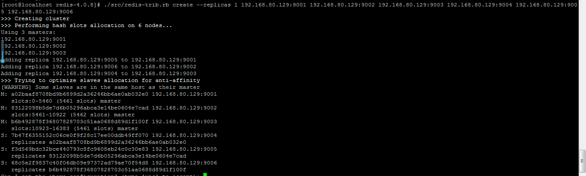
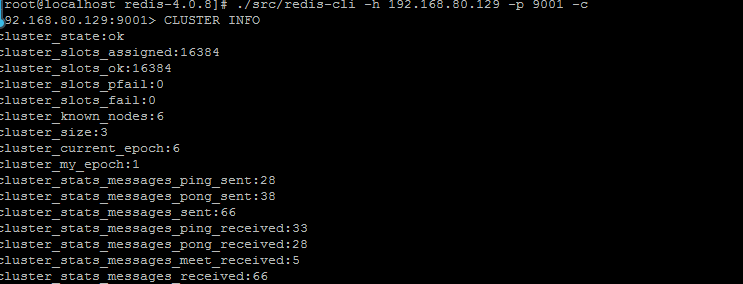
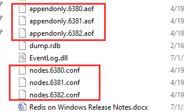

# 九、Redis 高并发集

[TOC]

#### 一、Redis 高并发集群示意图

　架构细节:

　　(1)所有的redis节点彼此互联(PING-PONG机制),内部使用二进制协议优化传输速度和带宽.

　　(2)节点的fail是通过集群中超过半数的节点检测失效时才生效.

　　(3)客户端与redis节点直连,不需要中间proxy层.客户端不需要连接集群所有节点,连接集群中任何一个可用节点即可

　　(4)redis-cluster把所有的物理节点映射到[0-16383]slot上,cluster 负责维护node<->slot<->value

redis-cluster选举:容错

　(1)领着选举过程是集群中所有master参与,如果半数以上master节点与master节点通信超过(cluster-node-timeout),认为当前master节点挂掉.

　(2):什么时候整个集群不可用(cluster_state:fail),当集群不可用时,所有对集群的操作做都不可用，收到((error) CLUSTERDOWN The cluster is down)错误

​    　　a:如果集群任意master挂掉,且当前master没有slave.集群进入fail状态,也可以理解成进群的slot映射[0-16383]不完成时进入fail状态.

​    　　b:如果进群超过半数以上master挂掉，无论是否有slave集群进入fail状态.

#### 二、redis集群搭建步骤

  cd /usr/local/   mkdir redis_cluster  //创建集群目录   mkdir 9001 9002 9003 9004 9005 9006 //分别代表六个节点，其对应端口 9001 9002 9003 9004                                   

​                                                                 9005 9006   //创建9001节点为例，拷贝到9001目录  cp /usr/local/redis-3.2.1/redis.conf  ./redis_cluster/9001/     //拷贝到9002 目录  cp /usr/local/redis-3.2.1/redis.conf  ./redis_cluster/9002/     //拷贝到9003目录  cp /usr/local/redis-3.2.1/redis.conf  ./redis_cluster/9003/     //拷贝到9004 目录  cp /usr/local/redis-3.2.1/redis.conf  ./redis_cluster/9004/     //拷贝到9005目录  cp /usr/local/redis-3.2.1/redis.conf  ./redis_cluster/9005/   

 //拷贝到9006目录  cp /usr/local/redis-3.2.1/redis.conf  ./redis_cluster/9006/   

 //分别对9001 9002 9003 9004 9005 9006文件夹中的3个文件修改对应的配置

daemonize    yes                          //redis后台运行 pidfile  /var/run/redis_9001.pid          //pidfile文件对应9001 9002 9003 9004 9005 9006 port  9001                                //端口9001 9002 9003 9004 9005 9006 cluster-enabled  yes                      //开启集群  把注释#去掉 cluster-config-file  nodes_7000.conf      //集群的配置  配置文件首次启动自动生成  cluster-node-timeout  5000                //请求超时  设置5秒够了 appendonly  yes                           //aof日志开启  有需要就开启，它会每次写操作都记          

​                                                              录一条日志

 //启动各节点

redis-server  redis_cluster/9001/redis.conf redis-server  redis_cluster/9002/redis.conf redis-server  redis_cluster/9003/redis.conf redis-server  redis_cluster/9004/redis.conf redis-server  redis_cluster/9005/redis.conf redis-server  redis_cluster/9006/redis.conf

 //查看服务

​     ps -ef | grep redis   #查看是否启动成功

  

  //创建集群

 /usr/local/redis-3.2.1/src/redis-trib.rb  create  --replicas  1  192.168.1.237:9001 192.168.1.237:9002  192.168.1.237:9003 192.168.1.238:9004 192.168.1.238:90015 192.168.1.238:9006

replicas  1  表示 自动为每一个master节点分配一个slave节点    上面有6个节点，程序会按照一定规则生成 3个master（主）3个slave(从)

//测试

​    redis-cli -c -p 7000 //客户端登陆

​     cluster nodes //查看集群节点

​    cluster info ：打印集群的信息

集群客户端命令（redis-cli -c -p port）

集群

cluster info ：打印集群的信息

cluster nodes ：列出集群当前已知的所有节点（ node），以及这些节点的相关信息。

节点

cluster meet <ip> <port> ：将 ip 和 port 所指定的节点添加到集群当中，让它成为集群的一份子。

cluster forget <node_id> ：从集群中移除 node_id 指定的节点。

cluster replicate <node_id> ：将当前节点设置为 node_id 指定的节点的从节点。

cluster saveconfig ：将节点的配置文件保存到硬盘里面。

槽(slot)

cluster addslots <slot> [slot ...] ：将一个或多个槽（ slot）指派（ assign）给当前节点。

cluster delslots <slot> [slot ...] ：移除一个或多个槽对当前节点的指派。

cluster flushslots ：移除指派给当前节点的所有槽，让当前节点变成一个没有指派任何槽的节点。

cluster setslot <slot> node <node_id> ：将槽 slot 指派给 node_id 指定的节点，如果槽已经指派给

另一个节点，那么先让另一个节点删除该槽>，然后再进行指派。

cluster setslot <slot> migrating <node_id> ：将本节点的槽 slot 迁移到 node_id 指定的节点中。

cluster setslot <slot> importing <node_id> ：从 node_id 指定的节点中导入槽 slot 到本节点。

cluster setslot <slot> stable ：取消对槽 slot 的导入（ import）或者迁移（ migrate）。

键

cluster keyslot <key> ：计算键 key 应该被放置在哪个槽上。

cluster countkeysinslot <slot> ：返回槽 slot 目前包含的键值对数量。

cluster getkeysinslot <slot> <count> ：返回 count 个 slot 槽中的键  

#### 三、集群搭建过程问题以及解决方案：

1、 gem install redis命令执行时出现了：

 redis requires Ruby version >= 2.2.2的报错，查了资料发现是Centos默认支持ruby到2.0.0，可gem 安装[redis](http://lib.csdn.net/base/redis)需要最低是2.2.2

解决办法是 先安装rvm，再把ruby版本提升至2.3.3

安装curl

sudo yum install curl

 安装RVM

curl -L get.rvm.io | bash -s stable 

source /usr/local/rvm/scripts/rvm

查看rvm库中已知的ruby版本

rvm list known

 安装一个ruby版本

rvm install 2.3.3

使用一个ruby版本

rvm use 2.3.3

设置默认版本

rvm remove 2.0.0

卸载一个已知版本

ruby --version

 再安装redis就可以了

gem install redis

2、重新安装集群

.停止当前Redis集群各节点的服务，然后删除对应的数据文件 *.aof 和配置文件 *.conf

