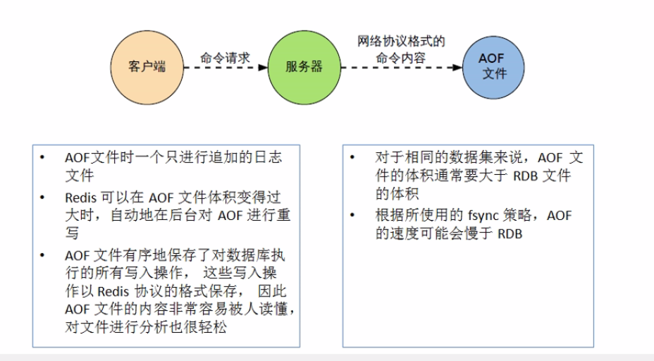

# 五、Redis持久化之AOF

[TOC]

#### 一、AOF简介

 AOF是以日志的形式来记录每个操作，将Redis执行的所有写指令记录下来（读操作不记录）。

只允许追加文件但不可以改写文件，redis启动之初会读取该文件重新构建数据，换言之，redis重启的话就根据日志文件的内容将文件指令从前到后的执行一次完成数据的恢复工作。

AOF保存的是appendonly.aof文件。

#### 二、AOF的配置策略

（1）aof默认是关闭的

​         appendonly no

 （2）aop同步策略

​          appendfsync alwarys|Everysec|No

​          alawys:同步持久化，每次发生数据更变会立刻记录到磁盘，性能较差但数据完整性较好。

​          Everysec：出厂默认推荐，异步操作，每秒记录，如果一秒宕机，有数据丢失。

​          No：不做持久化。

（3）Rewrite

​         Aop采用文件追加方式，文件会越来越大为避免出现此种情况，新增了重写机制，当aof文件的大小超过所设置的阈值时，redis就会启动aof的文件压缩，只保留可以恢复的最小指令集，可以使用命令bgrewriteaof。

​        重写原理：aof文件持续增长过大时，会fork出一个新的线程将文件重写（但是先写临时文件后再rename），遍历新进程的内存数据。每条记录有一条set的语句，重写aof文件的操作，并没有对取旧aof文件。而是将内存中的数据内容用命令的方式重写了一个新的aof文件。这点和快照有点类似。

​        触发机制：Redis会记录上次重写时aof大小，默认配置是当aof文件大小是上次rewrite后的大小

的一倍且文件大于64M时触发。

#### 三、AOF启动修复/恢复

  （1）正常恢复

​            启动：设置appendonly yes

​            将有数据的aof文件复制一份保存到对应的目录

​            恢复：重启redis然后重新加载

   （2）异常恢复

​            启动：设置Appendonly yes

​            备份被写坏的aof文件

​             修复：redis-check-aof --fix进行修复

​             恢复：重新启动redis重新加载。

#### 四、AOF的优劣势

​     （1）优势：

​              alawys:同步持久化，每次发生数据更变会立刻记录到磁盘，性能较差但数据完整性较好。

​              Everysec：出厂默认推荐，异步操作，每秒记录，如果一秒宕机，有数据丢失。

​              No：不做持久化。

​     （2）劣势：

​             相同数据集的数据而言AOF文件远大于RDB文件，文件恢复要慢于REB。

​             AOF的运行效率要慢于RDB，每秒同步策略效率较好，不同步效率与RDB相同。

​     

