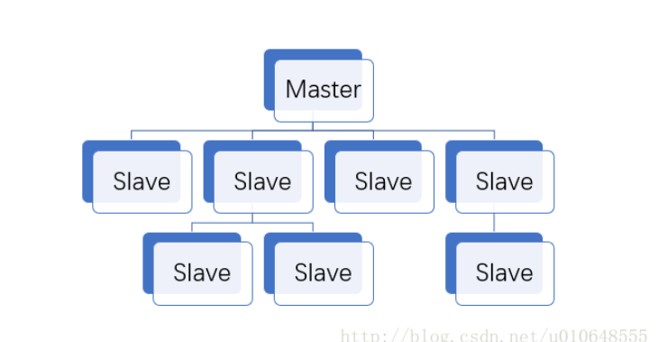
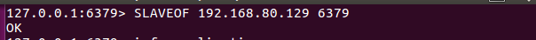
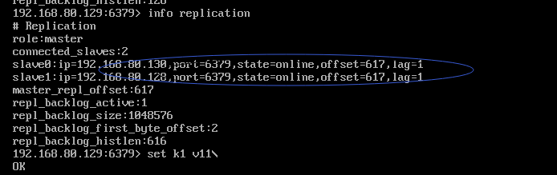
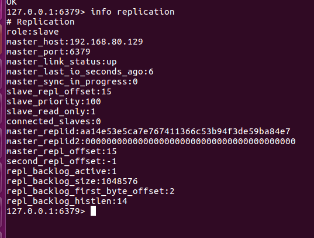

# 六、Redis主从复制

[TOC]

#### 一、Redis主从复制介绍

​      Redis主从复制主要为master和slave，其中master为主机，主要负责写操作，slave为从机，主要负责度操作。

读写分离；

​       其主要作用是：容灾恢复与读写分离。

#### 二、Redis主从配置的相关命令

   1、从机配置主机

​     slaveof 主机ip  主机端口  

   2、取消主从配置

​     slaveof no one

  3、查看主从配置情况

​      info replication

注意：如果主服务器配置了密码，从服务器也需要配置密码

#### 三、Redis主从复制配置思想

  1、配从不配主

  2、从机宕机后，需要重新slaveof主机

  3、从机中途配置后，会获取主机的所有信息

  4、主机宕机后，重新连接，将会变成从机，以前的从机中选取一个为主机

#### 四、主从复制相关场景实践

 1、一主二仆

   描述：一主二仆主要为一个主机，两个从机，主机用于写操作，从机为读操作。主机：192.168.80.129 ，从机：192.168.80.128 192.168.80.130 ；器示意图如下：

   配置过程如下：

   (1),分别修改redis的配置文件（redis.conf）的bind指令，默认情况只能本机访问，不能远程访问。

  （2）  两台从机分别配置主机

 （3）用info replication 命令查看主从配置情况

  主机：

从机：

