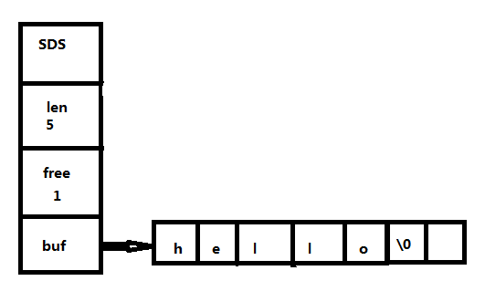

# 十、Redis的简单动态字符串

chenyx

[TOC]

#### 一、什么是简单动态字符串（SDS）

​       简单动态字符串（SDS）:SDS的全称是simple dynamic String，是redis基于C语的String字符串构建的动态字符串。是redis的主要底层实现之一。

​      SDS在redis的主要运用场景有：key的底层实现，redis五大类型中的String的底层实现。AOF模块中的buff缓存区。客户端中的缓存区等。

​      例如常见命令的

​      SET msg  ‘hello world ’

​      key：msg 的底层实现就是SDS

​      Value： ‘hello world ’的底层实现也是SDS

#### 二、SDS的定义

​     在redis源码中sds.h头文件定义了SDS，其SDS的定义如下所示：

struct sdshdr {

​    int len;

​    int free;

​    char buf[];

};

 buf：是一个字节数组，用于保存字符串

 len：标识记录buf数组已经使用的的数量，也就是SDS的长度。

 free：表示：buf数组未使用的数量，buf最后一个字节保存'\0',用于兼容C语言的String类型。调用C语言的函数库。这个字节不计入len值和free值

其SDS的示意图如下所示：

#### 三、SDS的优势

 1、获取字符串的时间复杂度为O（1）

​      SDS可以直接取len属性，获取字符串的长度。二C语中的String类型需要变量字节数组，其时间复杂度为O（n）

2、杜绝buf数组溢出

​    SDS每次变更之前都会检测len属性和free属性。如果当前存储空间不满足需求时，SDS会自动扩展直所需要的内存空间大小。而C语言的字符串没有对应的检测，将会导致数组溢出。

3、SDS减少了内存重分次数。这个主要有free属性和buf预留内存决定的。

#### 四、SDS空间分配和释放

  1、SDS空间分配

   SDS的分配主要有以下两种计算公式

  a、如果SDS修改后,SDS的len属性小于1MB，那么SDS则分配和len一样的未使用空间。则len属性和free属性相同。buf的总长度为len+free+1;

  b、SDS修改后了len属性大于或等于1MB时。SDS则会自动分配1MB的使用空间（free = 1MB），例如：len = 20MB，这是free = 1MB。buf的总长度为len+free+1;

2、SDS的空间释放是属性惰性释放。，当SDS保存字符串缩短时，并不会立刻释放多出来的字节空间。而是free将对应的空闲空间数记录起来。提供将来使用。如果我们需要真正的是否空闲空间。SDS提供相应的API（sdsfree）提供调用。

   