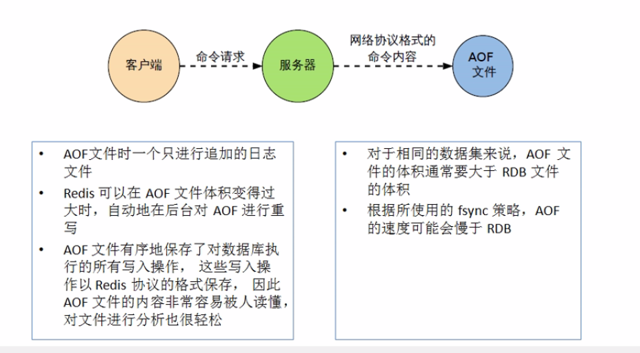

# 四、Redis持久化之RDB

[TOC]

#### 一、RDB（redis data base）

在指定的时间间隔内将内存的数据集快照写入磁盘，也就是通常讲的snapshot快照，它恢复时将快照文件直接读到内存中。

Redis会单独创建（fork）一个子进程来进行持久化，会将数据写到一个临时文件中，待持久化过程都结束了，在用这个临时文件替换上次持久化的文件。在整过过程中，主进程不进行任何io操作的，这就确保了极高的性能。

如果需要进行大规模的数据恢复，并且对数据恢复的完整性不是非常的敏感，那RDB方式要比AOF方式更加高效，RDB的缺点是最后一次持久化后的数据可能丢失。

#### 二、Fork

fork的作用是复制一个与当前进程一样的进程，该进程与主进程完全一致。但是该进程成是主进程的一个子进程。

snapshot快照

RDB默认有三种持久策略，分别是以下三种：

（1）900秒（15分钟）key修改过1次。

​          save 900 1

（2）300秒（5分钟）key修改过10次。

​     save 300 10

（3）60秒（1分钟）key修改过10000次。

​      save 60 10000

 （4）禁用

​         save “”

（5）手动持久化

​          save

​          bgsave

​           fulahAll --dump.db文件为空

stop-writes-on-basave-error

   默认配置：stop-writes-on-basave-error yes

   如果配置成no，表示你不在乎数据不一致或者其他的手段和控制。

rdbcompression

​      默认配置：rdbcompress yes

​       对于存储到磁盘的快照，可以设置是否进行压缩存储。redis采用LZF算法进行压缩存储。

 rdbchecksum

​       默认配置：rdbchecksum yes

​       在存储快照后，还可以让redis进行CRC64算法进行校验，这样校验大约增加10%的性能消耗。

  备份文件：dump.rdb

#### 三、备份恢复

​     将备份文件dump.rdb移动到即可。

#### 四、优势和劣势

优势

适合大数据的数据恢复。

对数据的完整性和一直性不高。

劣势

在一定时间做一次备份，如果在该时间内意外down，就会造成数据丢失。

在fork的时候，将内存的数据会克隆一份，会造成大致2倍的膨胀性，此时性能需要考虑。

