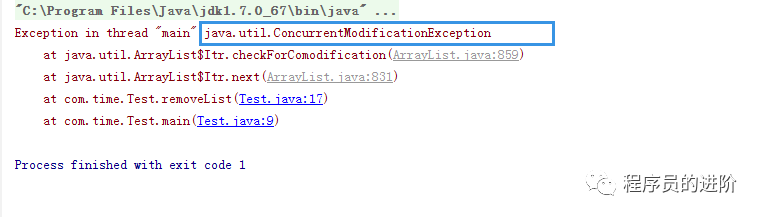

# List集合删除问题

将列表中移除掉，下图实现有无问题？

public static  void removeList() {

   List<Integer> list = new ArrayList();

   list.add(1);

   list.add(2);

   list.add(3);

   for (Integer i : list) {

​       if (i == 2) {

​          list.remove(i);

​           list.add(3);

​       }

   }

}

答：

运行运行将会抛如下异常：

通过查源码发现，List做循环内部依靠的为Iterable接口的实现类 Itr。该Itr类也是ArrayList的内部类。 该类在循环遍历时，不允许做增删操作。